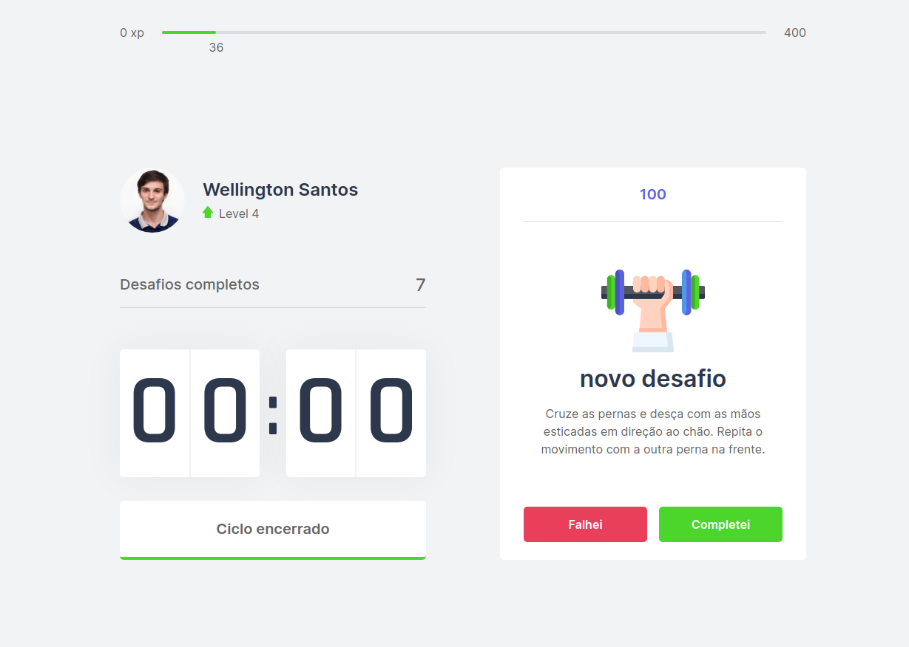

<h1 align="center">
    Move.it
</h1>

<p align="center"> 
  
</p>

<p align="center">
  <a href="#-tecnologias">Tecnologias</a>&nbsp;&nbsp;&nbsp;|&nbsp;&nbsp;&nbsp;
  <a href="#-projeto">Projeto</a>&nbsp;&nbsp;&nbsp;|&nbsp;&nbsp;&nbsp;
  <a href="#-como-executar">Como executar</a>&nbsp;&nbsp;&nbsp;|&nbsp;&nbsp;&nbsp;
  <a href="#-licença">Licença</a>
</p>

## 🚀 Aplicação

<h1 align="center">
  
</h1>

## 🛠 Tecnologias

As seguintes ferramentas foram usadas na construção do projeto:

- [Next.js](https://nextjs.org/)
- [React](https://pt-br.reactjs.org/)
- [TypeScript](https://www.typescriptlang.org/)

## 💻 Projeto

O projeto é baseado na tecnica de pomodoro. O qual é um metodo de geranciamento de tempo para focar 
em atividades, onde é expecificado um tempo de foco, como 25 minutos sem interrupções e tambem um
tempo de descanso. A aplicação buscou gamificar as conclusões de ciclos de foco, onde a cada ciclo completo e apresentado
um desafio, como fazer algum exercicio simples, e caso completo, o usuario ganha uma quantidade de experiencia, podendo avançar
de nivel.


## ✨ Como executar

```bash
# Clone o repositório
$ git clone https://github.com/wellingtondsf/laboral-nlw

# Instale as dependências
$ yarn install

# Inicie o servidor
$ yarn dev

# servidor iniciara na porta 3000
```

## 📜 Licença

Esse projeto está sob a licença MIT. Veja o arquivo [LICENSE](LICENSE) para mais detalhes.
